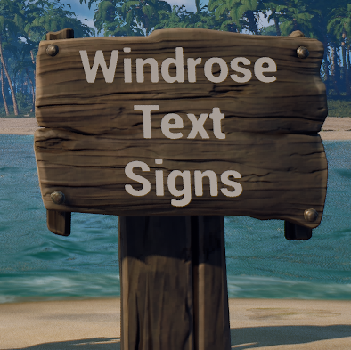

# WindroseTextSigns

WindroseTextSigns is a UE4SS C++ mod for Windrose that lets players turn native wooden labels into editable text signs.

The mod does not add a new build-menu item. Build any normal wooden label in game, look at it, press the configured hotkey (default F8), and enter the text you want displayed on the sign.



## Downloads

Get the latest packaged mod zip from the [GitHub Releases page](https://github.com/Ageous27/WindroseTextSigns/releases/latest).

## Features

- Edit placed wooden labels in game with a configurable hotkey.
- Hide the native white label icon when a label is converted into a text sign.
- Render text directly on the sign in the world.
- Persist sign text per world using sidecar JSON data.
- Support Solo, Hosted, and Dedicated Server play modes.
- Keep a client-side cache for reconnect display while the server remains authoritative in multiplayer.
- Use a UDP bridge for client/server sign-text updates.
- Auto route discovery for clients where possible, with static host fallback.
- UPnP port mapping supports `auto`, `on`, and `off` modes for dedicated/listen hosts.
- In multiplayer, players without the mod will still see normal signs.

## Requirements

- Windrose
- UE4SS installed for Windrose
- The same WindroseTextSigns mod package installed on both the client and the dedicated server for multiplayer use

## Installation

1. Download the latest zip from [Releases](https://github.com/Ageous27/WindroseTextSigns/releases/latest).
2. Extract the `WindroseTextSigns` folder into the UE4SS mods folder.

Client example:

```text
...\Windrose\R5\Binaries\Win64\ue4ss\Mods\WindroseTextSigns
```

Dedicated server example:

```text
...\WindowsServer\R5\Binaries\Win64\ue4ss\Mods\WindroseTextSigns
```

The mod folder should contain:

```text
enabled.txt
Config\WindroseTextSigns.ini
dlls\main.dll
```

## Usage

1. Build any native wooden label in game.
2. Look at the label.
3. Press `F8`.
4. Enter sign text in the in-game editor.
5. Press `Enter` to apply.
6. Use `Shift+Enter` for a new line.
7. Use `Esc` to cancel/close.

To clear a sign, open the editor, remove all text, and apply.

Destroying a sign should remove its saved text record after the mod confirms the sign is gone.

## Configuration

Configuration lives in:

```text
Config\WindroseTextSigns.ini
```

The most important production settings are:

```ini
[General]
WTS_ENABLED=true
WTS_HOTKEY=F8
WTS_MAX_TARGET_DISTANCE=1000
WTS_MIN_VIEW_DOT=0.92
WTS_BRIDGE_SERVER_HOST=auto
WTS_BRIDGE_UDP_PORT=45801
WTS_BRIDGE_UPNP_MODE=auto
WTS_BRIDGE_UPNP_ENABLED=true
```

### Hotkey

Change the edit hotkey with:

```ini
WTS_HOTKEY=F8
```

### Targeting

These settings control how close and centered a sign must be before the hotkey selects it:

```ini
WTS_MAX_TARGET_DISTANCE=1000
WTS_MIN_VIEW_DOT=0.92
```

### Multiplayer Bridge

Default bridge settings:

```ini
WTS_BRIDGE_SERVER_HOST=auto
WTS_BRIDGE_UDP_PORT=45801
WTS_BRIDGE_UPNP_MODE=auto
```

`WTS_BRIDGE_SERVER_HOST=auto` is the recommended default. Remote clients try to infer the server route from Windrose connection/log data.

If auto discovery does not work, set the client to a static server address:

```ini
WTS_BRIDGE_SERVER_HOST=your.server.ip.or.hostname
```

### UPnP Mode

Set host UPnP behavior with:

```ini
WTS_BRIDGE_UPNP_MODE=auto
```

Modes:

- `auto` (recommended): waits for observed bridge client network type and only attempts UPnP when public (internet) clients are detected.
- `on`: always attempts UPnP on dedicated/listen hosts.
- `off`: never attempts UPnP.

`auto` is best for mixed sessions and avoids unnecessary UPnP attempts for same-machine and LAN-only clients. If a host must be reachable from the internet immediately, use `on` or manual port forwarding.

`WTS_BRIDGE_UPNP_ENABLED` remains supported for backward compatibility:

- `true` maps to `WTS_BRIDGE_UPNP_MODE=auto`
- `false` maps to `WTS_BRIDGE_UPNP_MODE=off`

If UPnP is unavailable, manually forward the configured UDP bridge port to the dedicated server.

## Save Data

WindroseTextSigns stores text data outside the mod folder so it can survive mod deletion or reinstall when the user keeps the `R5\Saved` folder.

Dedicated server authoritative data:

```text
...\R5\Saved\SaveProfiles\Default\WindroseTextSigns\<worldIslandId>\SignTexts.json
```

Solo and Hosted authoritative data:

```text
%LOCALAPPDATA%\R5\Saved\SaveProfiles\<profileId>\WindroseTextSigns\<worldIslandId>\SignTexts.json
```

The mod also writes backups beside the main JSON file.

Remote clients keep a cache for display/reconnect help, but the server is the source of truth during multiplayer.

## Font Notes

Custom world text fonts are disabled by default because Windrose native font assets showed inconsistent runtime behavior in this mod path.

Default font settings:

```ini
WTS_WORLD_TEXT_FONT_ENABLED=false
WTS_WORLD_TEXT_FONT_ASSET=none
WTS_WORLD_TEXT_FONT_NAME_HINT=
WTS_WORLD_TEXT_FONT_NATIVE_FALLBACK=false
```

Raw font files alone are not enough for `TextRenderComponent`. A custom font needs a cooked Unreal `UFont` asset before it can be used reliably.

## Known Limitations

- The in-game editor is functional but visually simple.
- `Esc` can still also trigger the game escape menu in some cases.
- Auto server route discovery may not work for every network setup.
- UPnP depends on the router and local network configuration.
- Static IP or manual port forwarding may be needed for some dedicated servers.
