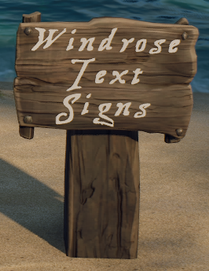

# WindroseTextSigns

WindroseTextSigns is a UE4SS C++ mod for Windrose that lets players edit text on placed native Wooden Labels.

You do not craft a new sign item. Build normal Wooden Labels, look at one, press `F8` (default), and edit text in the in-game window.

| Example 1 | Example 2 |
| --- | --- |
|  |  |

## Download

Get the latest packaged zip from [GitHub Releases](https://github.com/Ageous27/WindroseTextSigns/releases/latest).

## In-Game Usage

1. Build a normal Wooden Label.
2. Look at the label.
3. Press `F8` to open the editor.
4. Type text.
5. Use `Shift+Enter` for newline.
6. Press `Enter` or click `Apply` to save.
7. Press `F8` again or `Esc` to close without applying.
8. Use `Clear` to remove text for that sign.

## Status Display

The editor includes a `Status` section below the text box.

It shows:

- `Role: <value>`
- `Network: <value>`

Role values:

- `Solo`: local solo authoritative session.
- `Host`: hosted client authoritative session.
- `Remote Client`: connected client in multiplayer.
- `Error: Not locked`: role has not been locked for the current session yet.

Network values:

- Solo role:
  - `Solo`: sidecar load/save health is good.
  - `Error - Sign Text file not saved`: sidecar read/write health failed.
- Host role:
  - `Connected to Host Server`: hosted authority route is healthy.
  - `Error - Not connected to host server`: hosted authority route is not healthy.
- Remote Client role:
  - `Connected to Server`: route is healthy and authoritative data is current.
  - `Syncing...`: route is healthy and snapshot refresh is in progress.
  - `Error - check firewall, UPnP, or port settings` connection to the server failed.
  - `Error - Not connected to Server`: no healthy/current authoritative connection.

`Error - check firewall, UPnP, or port settings` is likely a network/port configuration issue.  The mods default configuration relies on UPnP.  UPnP must be enabled in the router for the clients, in the router for the dedicated server, and possibly in the game server manager software (if applicable).  Ensure the configured port (default 45801) is not blocked by firewalls.  If this can't be done or doesn't work see the Static Dedicated IP (UPnP Off) section below.  With static configuration ensure the selected UDP port (default 45801) is forwarded to your dedicated server and not blocked by firewalls.

`Error - Not connected to Server` is likely a network health issue.  Something has interrupted normal UDP network traffic, if traffic is restored this should automatically return to `Connected to Server`

`Syncing...` means the Remote Client has sent a request to the dedicated server and is waiting for the response.  You might not ever see this message if the response is fast.  That doesn't mean syncing has not occurred.


## What Is In The Zip

The zip includes:

- Mod folder:
  - `WindroseTextSigns\enabled.txt`
  - `WindroseTextSigns\Config\WindroseTextSigns.ini`
  - `WindroseTextSigns\dlls\main.dll`
- Optional font override package:
  - `Content\Paks\~mods\0_WindroseTextSigns_RDFOverride_P.pak`
  - `Content\Paks\~mods\0_WindroseTextSigns_RDFOverride_P.utoc`
  - `Content\Paks\~mods\0_WindroseTextSigns_RDFOverride_P.ucas`


## Installation Paths

Use these path variables in this README:

```text
<WindroseClientRoot>      = your Windrose install root
<HostedServerRoot>        = <WindroseClientRoot>\R5\Builds\WindowsServer\R5
<DedicatedServerRoot>     = your dedicated server R5 root
```

## Install: Solo Play Only

1. Close Windrose.
2. Copy mod folder from zip:
   - source: `WindroseTextSigns\`
   - destination: `<WindroseClientRoot>\R5\Binaries\Win64\ue4ss\Mods\WindroseTextSigns`
3. Optional font package install (recommended for themed font):
   - source: `Content\Paks\~mods\0_WindroseTextSigns_RDFOverride_P.pak/.utoc/.ucas`
   - destination: `<WindroseClientRoot>\R5\Content\Paks\~mods\`
4. Start game.

## Install: Hosted Sessions

Hosted sessions use both a client runtime and a local hosted server runtime.

UE4SS and this mod must be installed in both locations.

1. Close Windrose.
2. Install to Hosted Client (your normal game install):
   - mod destination:
     - `<WindroseClientRoot>\R5\Binaries\Win64\ue4ss\Mods\WindroseTextSigns`
   - optional font package destination:
     - `<WindroseClientRoot>\R5\Content\Paks\~mods\`
3. Install to Hosted Server runtime:
   - mod destination:
     - `<HostedServerRoot>\Binaries\Win64\ue4ss\Mods\WindroseTextSigns`
   - optional font package destination:
     - `<HostedServerRoot>\Content\Paks\~mods\`

Notes:
- The font package is primarily visual and matters most on clients that render sign text.
- For consistency during troubleshooting, install the same mod version in both client and hosted server locations.

## Install: Dedicated Server

1. Install mod on each client that should view/edit signs:
   - `<WindroseClientRoot>\R5\Binaries\Win64\ue4ss\Mods\WindroseTextSigns`
2. Install mod on dedicated server:
   - destination:
     - `<DedicatedServerRoot>\Binaries\Win64\ue4ss\Mods\WindroseTextSigns`
3. Optional font package on clients:
   - `<WindroseClientRoot>\R5\Content\Paks\~mods\`
4. Optional font package on dedicated server:
   - `<DedicatedServerRoot>\Content\Paks\~mods\`

## Revert To Default In-Game Font

To use default game font rendering again, remove or do not install these three files:

- `0_WindroseTextSigns_RDFOverride_P.pak`
- `0_WindroseTextSigns_RDFOverride_P.utoc`
- `0_WindroseTextSigns_RDFOverride_P.ucas`

From:

- Client: `...\Windrose\R5\Content\Paks\~mods\`
- Hosted server: `...\Windrose\R5\Builds\WindowsServer\R5\Content\Paks\~mods\`
- Dedicated server: `...\WindowsServer\R5\Content\Paks\~mods\`

## Save Data

Authoritative save locations:

- Solo and Hosted Client:
  - `%LOCALAPPDATA%\R5\Saved\SaveProfiles\<profileId>\WindroseTextSigns\<worldIslandId>\SignTexts.json`
- Dedicated Server:
  - `...\R5\Saved\SaveProfiles\Default\WindroseTextSigns\<worldIslandId>\SignTexts.json`

Backups are written beside the main JSON file.

## Configuration

Config file:

```text
WindroseTextSigns\Config\WindroseTextSigns.ini
```

Most-used settings:

```ini
[General]
WTS_ENABLED=true
WTS_HOTKEY=F8
WTS_MAX_TARGET_DISTANCE=1000
WTS_MIN_VIEW_DOT=0.92
WTS_BRIDGE_SERVER_HOST=auto
WTS_BRIDGE_UDP_PORT=45801
WTS_BRIDGE_UPNP_MODE=auto
WTS_FORCE_LOCAL_ONLY=false
```

WTS_FORCE_LOCAL_ONLY=true will force all text sign data to be saved locally.  It will no longer sync with server, and other players connected to the server will not see the local edits.  Leave this false on the dedicated server.


### Static Dedicated IP (UPnP Off)

If you want manual networking for dedicated server sessions, use a fixed server IP/hostname and disable UPnP.

Client `WindroseTextSigns\Config\WindroseTextSigns.ini`:

```ini
[General]
WTS_BRIDGE_SERVER_HOST=<DedicatedServerIP-or-DNS>
WTS_BRIDGE_UDP_PORT=45801
WTS_BRIDGE_UPNP_MODE=off
```

Dedicated server `WindroseTextSigns\Config\WindroseTextSigns.ini`:

```ini
[General]
WTS_BRIDGE_SERVER_HOST=auto
WTS_BRIDGE_UDP_PORT=45801
WTS_BRIDGE_UPNP_MODE=off
```

Important:
- With static configuration ensure the selected UDP port (default 45801) is forwarded to your dedicated server.
- UDP transport is required by the current bridge implementation.
- There is no supported `UDP disabled` mode in current builds.
- Client and server must use the same `WTS_BRIDGE_UDP_PORT`.

## Troubleshooting

- If signs do not update in multiplayer, confirm matching mod version on all required roles for that mode.
- If route discovery fails on dedicated server, set a static host in client config:
  - `WTS_BRIDGE_SERVER_HOST=your.server.ip.or.hostname`
- Keep both logs when reporting issues:
  - `WindroseTextSigns.log`
  - `R5.log`

## Known Limitations

- The editor is functional-first and visually minimal.
- Auto route discovery can still depend on network environment specifics.
- Rare UE4SS/session-exit instability may still occur in some environments.
